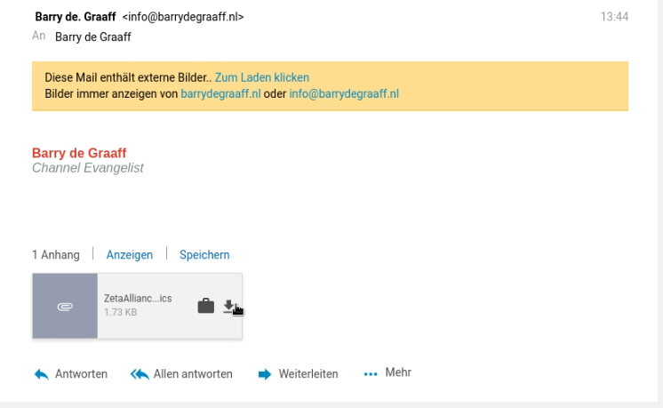
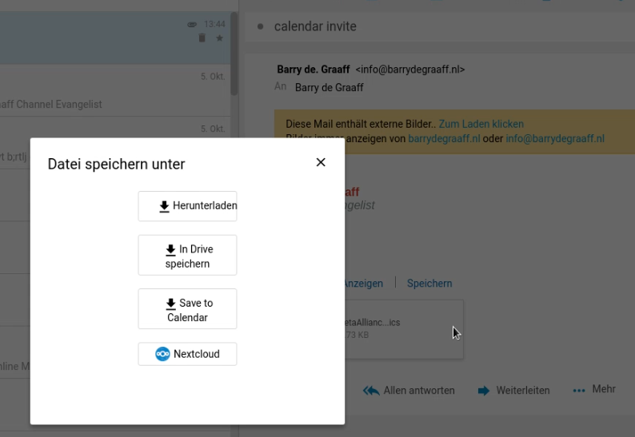
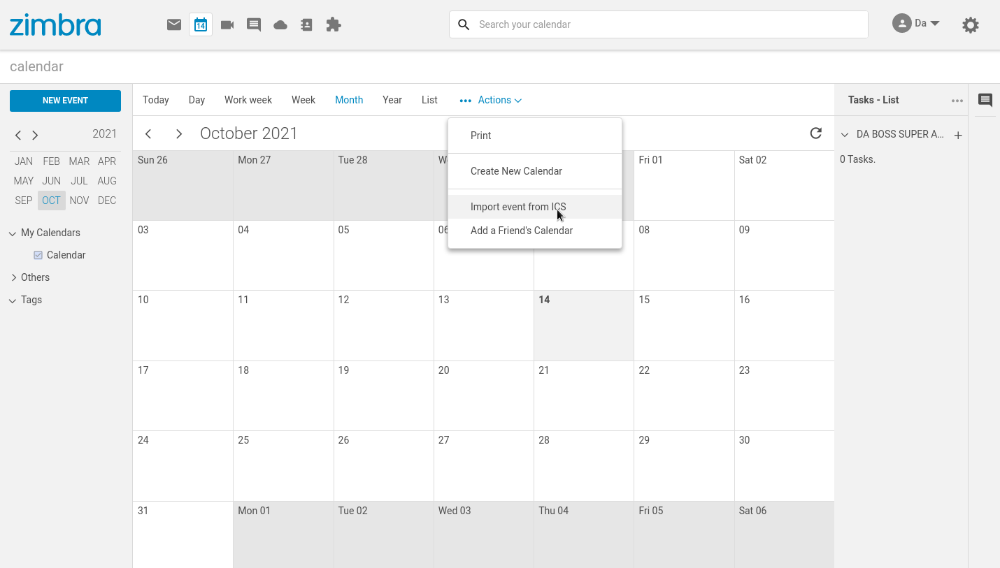
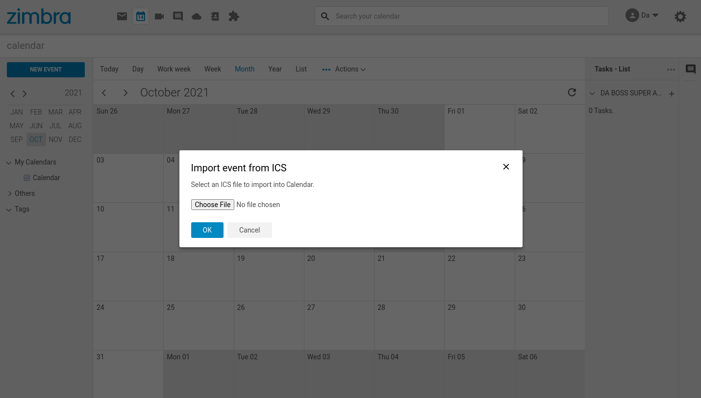

# Import an event from ics file

This Zimlet adds an option in the mail view for ICS attachments and allow to import into Calendar. In addition it also adds a menu option in the Calendar Actions menu to import an ICS via upload.

## Screenshots

> 
> 
> 
> 

